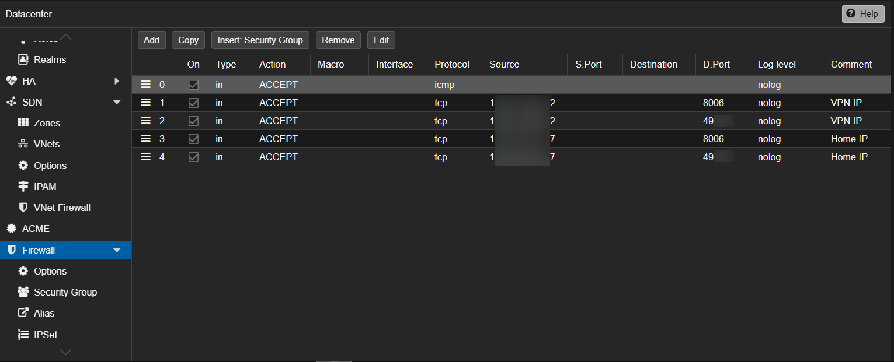
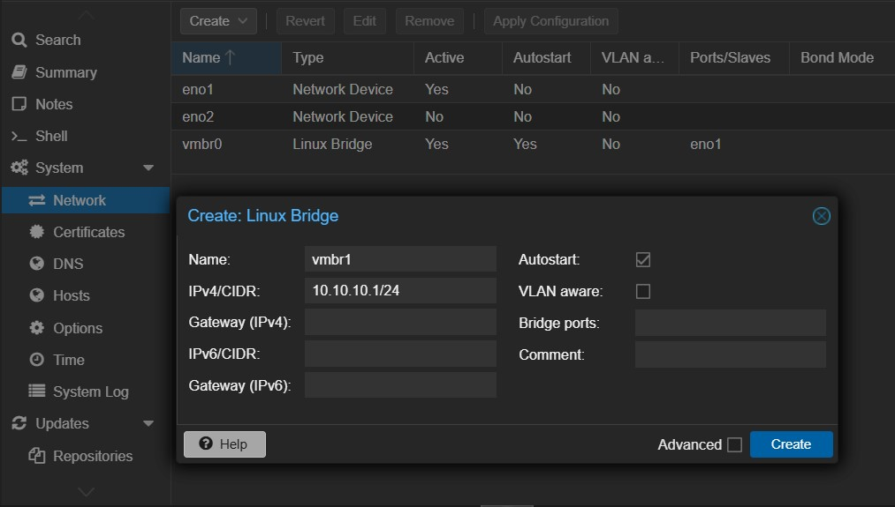
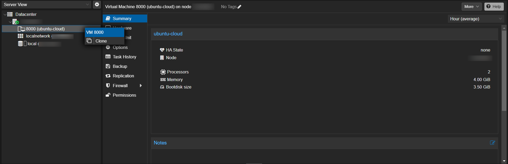
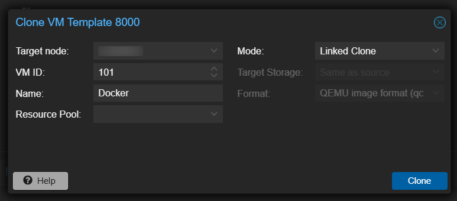
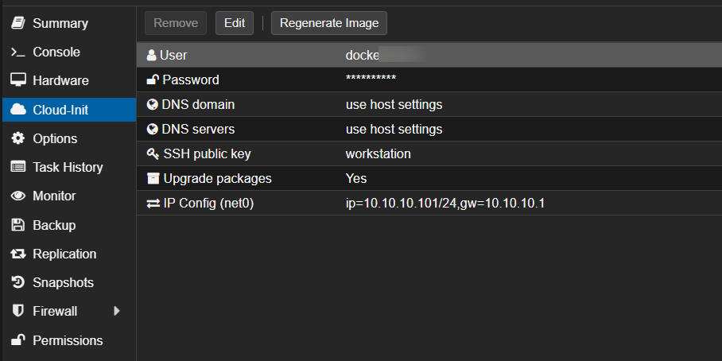

# Server and Proxmox Setup

## Introduction

This document serves as personal notes for setting up a bare metal server running Proxmox VE. While it uses OVHcloud as the hosting provider example, the Proxmox setup instructions should be applicable to any provider. This guide is not intended to be comprehensive but rather a practical reference for essential setup steps.

**Please note:** use this guide at your own discretion. The instructions are based on personal experience and may not account for all potential scenarios or configurations. I do not guarantee or promise that these instructions will work as expected or ensure the security of your setup. Ensure you have proper backups and understand the implications before applying any changes.

## 1. Setting Up the Server and Proxmox

To set up an OVHcloud bare-metal server and install Proxmox, refer to the following guide as a starting point: [Getting Started with a Dedicated Server](https://support.us.ovhcloud.com/hc/en-us/articles/19309916819987-Getting-Started-with-a-Dedicated-Server)

## 2. Basic Security Recommendations

For security best practices, review OVHcloud’s official guides:

- [Securing a Dedicated Server ver.1](https://help.ovhcloud.com/csm/en-dedicated-servers-securing-server?id=kb_article_view&sysparm_article=KB0043988)
- [Securing a Dedicated Server ver.2](https://support.us.ovhcloud.com/hc/en-us/articles/4416199959955-Securing-a-Dedicated-Server)

I will follow the steps from these guides but also include additional measures like adding an SSH public key and restricting server access to key-based authentication only.

1. Log in as your server user. The server IP can be found in the general information of your dedicated server.

    ```bash
    ssh root@server-ip
    ```

2. Update the server:

    ```bash
    apt update
    apt upgrade
    ```

3. Change the default SSH listening port by edit the SSH configuration file:

    ```bash
    nano /etc/ssh/sshd_config
    ```

    Uncomment and modify the `#Port` line:

    ```text
    #port 22
    ```

    Replace `22` with a number between `49152` and `65535` as recommended by OVH in [How to secure a dedicated server](https://help.ovhcloud.com/csm/en-dedicated-servers-securing-server?id=kb_article_view&sysparm_article=KB0043988).    Restart the service:

    ```bash
    sudo systemctl restart sshd
    ```

4. Change the root user password:

    ```bash
    passwd
    ```

5. Create a new user with restricted privileges:

    ```bash
    adduser CustomUserName
    ```

6. Set up an SSH key for the new user. Switch to the new user:

    ```bash
    su CustomUserName  
    ```

    Create an .ssh directory and set proper permissions:

    ```bash
    mkdir -p ~/.ssh 
    chmod 700 ~/.ssh
    touch ~/.ssh/authorized_keys
    chmod 600 ~/.ssh/authorized_keys
    chown -R CustomUserName:CustomUserName ~/.ssh
    ```

    Add your public key:

    ```bash
    nano ~/.ssh/authorized_keys
    ```

    Test the connection:

    ```bash
    ssh CustomUserName@server-ip -p [custom-port] -i ~/.ssh/private_key
    ```

7. Disable root login and enforce key-based authentication. Switch back to the root user:

    ```bash
    su
    ```

    Edit the SSH configuration file:

    ```bash
    nano /etc/ssh/sshd_config
    ```

    Add or modify the following lines:

    ```text
    PermitRootLogin no
    PubkeyAuthentication yes
    AllowUsers CustomUserName
    AuthenticationMethods publickey
    PasswordAuthentication no
    ChallengeResponseAuthentication no
    UsePAM no
    ```

    Restart the SSH service:

    ```bash
    sudo systemctl restart sshd
    ```

    Retest connection again:

    ```bash
    ssh CustomUserName@server-ip -p [custom-port] -i ~/.ssh/private_key
    ```

    Now, you should be able to connect to the server only with your new `CustomUserName`. Connection to the server using the root user should fail.

## 3. Basic Proxmox Security Recomendations

1. Enable Two-Factor Authentication (2FA). Follow the [Proxmox 2FA setup guide](https://pve.proxmox.com/wiki/Two-Factor_Authentication)

2. Set up firewall rules in Proxmox on datacenter level.

    

    Configure the Proxmox firewall to restrict access to ports `8006` (web interface) and the custom SSH port. Allow ICMP (ping) traffic to avoid OVH monitoring errors.

    > Make sure you enable the rules BEFORE enabling the firewall. Double-check any changes, as locking yourself out of the dashboard or SSH port would require reinstalling Proxmox and starting from the beginning to restore access.

    For detailed instructions, watch this [Learn Linux TV](https://www.youtube.com/watch?v=DNsLLrCgK0U) tutorial.

3. Disable paid tier updates. Edit the Proxmox Enterprise repository file:

    ```bash
    nano /etc/apt/sources.list.d/pve-enterprise.list
    ```

    Comment out the following line:

    ```text
    deb https://enterprise.proxmox.com/debian/pve buster pve-enterprise
    ```

## 4. Internal Network Setup

This setup creates a private network in Proxmox where virtual machines (VMs) can communicate with each other. A DHCP server is added to automatically assign IP addresses, and NAT is configured to allow internet access for the VMs.

1. Add a new bridge `vmbr1` via the Proxmox GUI. Specify a private network with a CIDR, for example, `10.10.10.1/24`, and apply the changes.

    

    Click the `Apply Configuration` button after adding the bridge.

2. Edit the network configuration file. Open the file `/etc/network/interfaces` using a text editor:

    ```bash
    nano /etc/network/interfaces
    ```

    Locate the configuration section for the newly added bridge `vmbr1` and add the following lines:

    ```text
    post-up   echo 1 > /proc/sys/net/ipv4/ip_forward
    post-up   iptables -t nat -A POSTROUTING -s '10.10.10.0/24' -o vmbr0 -j MASQUERADE
    post-down iptables -t nat -D POSTROUTING -s '10.10.10.0/24' -o vmbr0 -j MASQUERADE
    post-up   iptables -t raw -I PREROUTING -i fwbr+ -j CT --zone 1
    post-down iptables -t raw -D PREROUTING -i fwbr+ -j CT --zone 1
    ```

3. Apply the network configuration. Save the file and execute the following command to apply the changes:

    ```bash
    ifreload -a
    ```

4. Install the DHCP server package. Run the following command to install the DHCP server:

    ```bash
    apt install isc-dhcp-server -y
    ```

5. Update the DHCP server configuration. Edit the default configuration file `/etc/default/isc-dhcp-server`:

    ```bash
    nano /etc/default/isc-dhcp-server
    ```

    Update the `INTERFACESv4` line to specify `vmbr1`:

    ```text
    INTERFACESv4="vmbr1"
    INTERFACESv6=""
    ```

6. Backup and remove the existing DHCP configuration file. Create a backup of the original DHCP configuration file and remove it:

    ```bash
    cp /etc/dhcp/dhcpd.conf /etc/dhcp/dhcpd-bac.conf
    rm /etc/dhcp/dhcpd.conf
    ```

7. Create a new DHCP configuration file. Open a new file for the DHCP configuration:

    ```bash
    nano /etc/dhcp/dhcpd.conf
    ```

    Add the following content to configure the DHCP server:

    ```text
    option domain-name-servers 1.1.1.1, 8.8.8.8, 9.9.9.9;

    subnet 10.10.10.0 netmask 255.255.255.0 {
        range 10.10.10.100 10.10.10.150;
        option routers 10.10.10.1;
        authoritative;
        default-lease-time 21600000;
        max-lease-time 432000000;
    }
    ```

    Save and close the file. Restart:

    ```bash
    systemctl restart isc-dhcp-server
    ```

    Your Proxmox network and DHCP server should now be configured to serve an internal network using `vmbr1`.

## 5. Virtual machine image template

This guide helps you create a reusable virtual machine (VM) image template in Proxmox using an Ubuntu Cloud Image. It is based on a wonderful [article](https://technotim.live/posts/cloud-init-cloud-image/) and [video](https://www.youtube.com/watch?v=shiIi38cJe4) by Techno Tim. Huge thanks to him for all his videos!

1. Choose your [Ubuntu Cloud Image](https://cloud-images.ubuntu.com/). Download Ubuntu (replace with the url of the one you chose from above)

    ```bash
    wget https://cloud-images.ubuntu.com/oracular/current/oracular-server-cloudimg-amd64.img
    ```

2. Create a new virtual machine

    ```bash
    qm create 8000 --memory 4096 --core 2 --name ubuntu-cloud --net0 virtio,bridge=vmbr1
    ```

3. Import the downloaded Ubuntu disk to local storage

    ```bash
    qm importdisk 8000 oracular-server-cloudimg-amd64.img local
    ```

4. Attach the new disk to the vm as a scsi drive on the scsi controller

    ```bash
    qm set 8000 --scsihw virtio-scsi-pci --scsi0 local:8000/vm-8000-disk-0.raw
    ```

5. Add cloud init drive

    ```bash
    qm set 8000 --ide2 local:cloudinit
    ```

6. Make the cloud init drive bootable and restrict BIOS to boot from disk only

    ```bash
    qm set 8000 --boot c --bootdisk scsi0
    ```

7. Add serial console

    ```bash
    qm set 8000 --serial0 socket --vga serial0
    ```

8. Create template

    ```bash
    qm template 8000
    ```

9. Create a new virtual machine from template. You can use Proxmox GUI for that.

    

    Name your VM and and set ID.

    

    For each VM I would specify the following settings:

    - Change allocated RAM and disk size
    - In `Hardware/Processor`, select the `Host` option instead of `KVM`.
    - Activate `QEMU Guest Agent` at `Options`.
    - Update `Cloud-Init` section:
        - Use a username other than root.
        - Set a password.
        - Add the SSH key from your local machine.
    - In IP config, specify an IP address within the local network, such as `10.10.10.101/24`, where the last three digits match the VM ID (`101` in this case) for easier navigation. Gateway: Use `10.10.10.1`, which will be the same for all machines.

    

10. Setting Up Port Forwarding for Virtual Machines. 

    > We used port forwarding instead of dedicated IPs to access VMs on our Proxmox server in order to reduce costs and simplify management with a single public IP. While this approach is cost-effective and simplifies network management, it comes with limitations such as potential port conflicts, reduced traffic isolation, and limited scalability for a large number of VMs.

    The setup involves adding a rule for port forwarding on the Proxmox server. The command looks like this:

    ```text
    #Allow external access to port 22 of vm 101 
    post-up   iptables -t nat -A PREROUTING -i vmbr0 -s [your-ip]/24 -p tcp --dport 10101 -j DNAT --to 10.10.10.101:22
    post-down iptables -t nat -D PREROUTING -i vmbr0 -s [your-ip]/24 -p tcp --dport 10101 -j DNAT --to 10.10.10.101:22
    ```

    Explanation of the Rule:
    - This rule forwards traffic arriving at the vmbr0 interface (external network) over the TCP protocol on port 10111 to the internal IP 10.10.10.111 on port 22 using NAT routing.
    - The segment -s [your-ip]/24 limits the forwarding to requests originating from the specified subnet. If you don’t need this restriction, you can omit this part.

    Open the file /etc/network/interfaces with a text editor:

    ```bash
    nano /etc/network/interfaces
    ```

    Add the above post-up and post-down commands after any existing rules for post-up and post-down.     After saving the file, apply the changes with:

    ```bash
    ifreload -a
    ```

    *Troubleshooting and Verification*
    To check if traffic is flowing as expected:

    ```bash
    tcpdump -i any tcp port 443  
    ```

    To view active iptables rules:

    ```bash
    iptables -L -t nat  
    ```

    If rules overlap or conflict, clear all NAT rules with:

    ```bash
    iptables -t nat -F
    ```

    Then reapply the configuration using:

    ```bash
    ifreload -a
    ```

11. Start the VM and verify that you can connect to it:

    ```bash
        ssh CustomUserName@server-ip -p 10101 -i ~/.ssh/private_key
    ```

12. If you successfully connected to the machine, [install Qemu-guest-agent](https://pve.proxmox.com/wiki/Qemu-guest-agent)

13. Reload the machine and check if you can ping the VM from the host server:

    ```bash
    qm agent <vmid> ping
    ```

You’ve now set up Proxmox VE and configured your virtual machines with the minimum security and network settings. Be sure to test everything to ensure it's working as expected and back up your configurations regularly. For troubleshooting, refer to Proxmox documentation and the community forums.

## 6. Next steps

- Docker and Traefik installation (coming soon)
- Clickhouse installation (coming soon)
- Postgres installation (coming soon)
